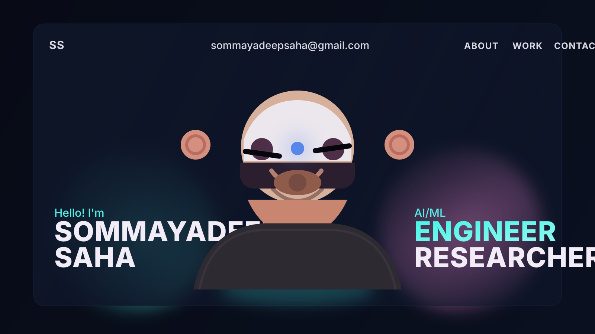

# My Portfolio Wesbite - Overview 🚀

This repository contains the open source version of my porfolio website.
Do check it out!

## Instructions 🛠️

I have modified the gsap club plugins with the trial plugins, but with the trial plugin you cannot host it🔴. So for Club plugins, Check out here: https://gsap.com/docs/v3/Installation/

**Techstack** - React, TypeScript, GSAP, ThreeJS, WebGL, HTML, Css, JavaScript

## Auto-sync Projects From GitHub

The Work section is now synced from your GitHub repositories.

1. Set your username in `.env`:

```bash
VITE_GITHUB_USERNAME=sommayadeep
```

1. Add screenshot files inside `public/`.
1. Map each repo name to its image in `src/data/projectImageMap.ts`.

How it works:

- Fetches public repos from `https://api.github.com/users/<username>/repos`.
- Excludes forks and archived repos.
- Sorts by latest update date and shows a timeline automatically.
- Uses `homepage` or GitHub Pages URL as project link (fallback: repo URL).



## License

This project is open source and available under the [MIT License](LICENSE).
